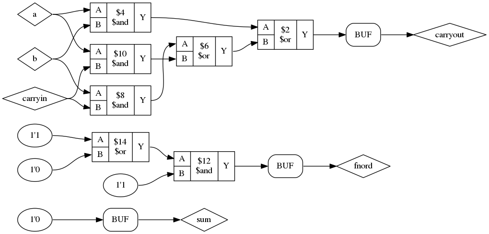

# Yodl

This is a work in progress VHDL frontend
for the Yosys toolchain.

`Current status:` Currently I'm able to completely evaluate
generate statements and for loops (for and if; case generate is not supported, but will be). 
Speaking of for loops, there is a grain of salt. The VHDL synthesis
standard from 2004 pinpoints that `next` and `exit` statements be explicitly
allowed inside of for loops. This is a problem, because in certain cases an
occuring statement of those two types can make the whole loop (statically) non-evaluable.
Thus my current for loop unroller does *not* support them.

Furthermore I built appropriate infrastructure for AST traversals which is
largely functor based and not very well documented at this point of time.

As of now, I also accomplished:
- elsif elimination. The elsif eliminator transforms 
```vhdl
    if (3=3) then
      s1;
    elsif (4=4) then
      s2;
    else 
      s3;
    end if;
```
  into
```vhdl
    if (3=3) then
      s1;
    else
      if (4=4) then
        s2;
      else 
        s3;
      end if;
    end if;
```

- if/else to case transformation. The functor BranchesToCases transforms
```vhdl
    if (3=3) then
      s1;
    else
      if (4=4) then
        s2;
      else 
        s3;
      end if;
    end if;
```
  into
```vhdl
  case (3=3) is
    when TRUE => s1;
    when FALSE => 
      case (4=4) is
        when TRUE => s2;
        when FALSE => s3;
      end case;
  end case;
```
  Now the multiplexer structures that are modelled by if/elsif/else-clauses 
  become obvious and are hopefully simple enough to translate to Cliffords RTLIL-API.
  
`A rant about VHDL's grammar: `. VHDL's grammar is utterly ambiguous. There are
a lot of reduce/reduce (and even more shift/reduce) conflicts in the grammar.
Reduce/reduce conflicts (in context LR(1)) usually is a very strong implication
for the grammar being in the class of non-deterministic context free languages and
this is *bad news* because it further implies, that parsing is very _very_ hard.

There already is a pretty good [article](http://eli.thegreenplace.net/2009/05/19/parsing-vhdl-is-very-hard) about this that I want to refer to.

Stephen Williams wrote a pretty slick `parse.y` that properly matches most of VHDL's syntax. Sadly, there
are some ugly twists that he had to make in order to unambiguously construct just one parse tree for any
given input. I thought a bit and came to the conclusion that it might be best, to rewrite the parser by using
one of bisons newer features: GLR, Generalized LR, an algorithm for ambiguous grammars. 

As an example what the current parser cannot (and probably will never be able to) parse is:
```vhdl
architecture beh of ent is
   -- some decls
begin
   -- this should be parsable, but produces syntax error
   result <= foo(fnord => 3, foobar => 4)(3);
   
   -- this is parsable
    result <= foo(4, 3)(3);
end beh;
```

The problem is that the alterations of VHDL's grammar also 
affected how names (identifiers, array indexing, ...) are matched.
The standard dictates that a name is parsed as

```
name ->   prefix ( expression {, expression } )
        | prefix . suffix
        | operator_symbol
        | identifier
        
prefix -> name | function_call

function_call -> name ( association_list )
        
suffix consists solely of terminal symbols
```

whereas `parse.y` specifies prefixes as

    prefix -> name
    
and emulates function calls inside of expressions
by misusing the

    prefix ( expression {, expression } )
    
rule.

### 4. Aug 2016

I did further research on the topic `parse all of VHDL 2008`. There
is a [project](https://github.com/BNFC/bnfc) that automates away most of the hugely repetitive work of writing an compiler frontend. Moreover, I found a repository on github that contains a copy of VHDL-2008 bnf grammar. Sadly the author simply copy pasted it from the original reference manual. This is unformunate, because the BNF derivative the IEEE authors use in their manual is not at all copy paste friendly because of their glorious `semantic rule prefixes`.
Hence the standard text contains grammar rules like: *package*_simple_name ::= foobar. A *package*_simple_name simply is a simple_name but prefixed for better understandability. Since there is no italic font for plain text files, I now manually have to check the complete grammar (1300 LoC) and remove the semantic prefixes.

### 16. Aug 2016

Today is a day to celebrate. First actual netlist has been created!
Yodl translated this
```
library ieee;
use ieee.std_logic_1164.all;
use ieee.std_logic_arith.all;
use ieee.std_logic_unsigned.all;

entity adder is
   port(A        : in  std_logic;
        B        : in  std_logic;
        carryIn  : in  std_logic;
        carryOut : out std_logic;
        fnord    : out std_logic;
        sum      : out std_logic);
end adder;

architecture behv of adder is
begin
--   sum      <= A xor B xor carryIn;
   sum <= '0';
   carryOut <= (a and b) or
               (b and carryIn) or
               (a and carryIn);

   fnord <= ('1' or '0') and '1';
end behv;
```

into that:



## Current milestone

Be able to generate RTLIL from a subset
of VHDL.

## Ultimate goal

Be able to generate (correct) RTLIL from
VHDL as specified in IEEE 1076.6-2004.
